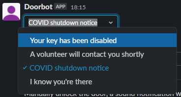
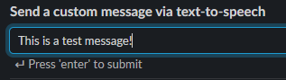
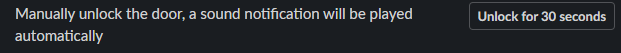

# doorSlack
This code is designed to create a control interface for DoorBot via Slack.

## Requirements

* [slack_bolt](https://pypi.org/project/slack-bolt/)
* [pyserial](https://pypi.org/project/pyserial/)

### Linux

* TTS via `espeak` https://packages.ubuntu.com/impish/espeak-ng-espeak
* MP3 playback via `mpg123`https://github.com/gypified/libmpg123

### Windows

Windows lacks some basic command line tools used by the script. As the intended final device is a Raspberry Pi running Linux replacements have been provided in the repo.

* TTS via `wsay.exe` https://github.com/p-groarke/wsay
* MP3 playback via `cmdmp3.exe` https://github.com/jimlawless/cmdmp3

## Configuration

Use `config.json.template` as a template.

* `SLACK_APP_TOKEN`: App level token with at least `connections:write`. This is required to open sockets with the Slack event API. Generated on **Basic Information**
* `SLACK_BOT_TOKEN`: Bot level token with at least `chat:write``groups:history`. This is required to listen for and respond to messages in channels the bot has been added to.
* `doorAccess`: `true|false` Does the current script have access to the Arduino controlling the door? Required to make the unlock button work.
* `arduino`:  `{"pointer":"","baudrate":}` How do we communicate with the Arduino? A likely config is `{"pointer":"/dev/ttyACM0","baudrate":9600}`
* `channel`: Channel ID of the channel that the bot should respond to. #security

## Running

`./slackControl.py`

There is no runtime configuration.

## Usage

* Invite your bot to a channel. *private is strongly recommended*
* Type `control`
* Interact with the tools provided

### Playback of premade files

The following sounds have been hardcoded.

| Dropdown option                      | Actual message                                               | id                | source                                                    |
| ------------------------------------ | ------------------------------------------------------------ | ----------------- | --------------------------------------------------------- |
| Your key has been disabled           | Your key has been disabled. A Perth Artifactory volunteer will contact you soon. | key_disabled      | [Amazon Polly](https://ai-service-demos.go-aws.com/polly) |
| A volunteer will contact you shortly | There is a technical issue. A Perth Artifactory volunteer will contact you shortly. | volunteer_contact | [Amazon Polly](https://ai-service-demos.go-aws.com/polly) |
| COVID shutdown notice                | Access to the Perth Artifactory workshop has been restricted under the current WA Health COVID-19 guidelines. If you have any questions or need to retrieve an item please reach out on Slack. | covid             | [Amazon Polly](https://ai-service-demos.go-aws.com/polly) |
| I know you're there                  | I know you're there, I can feel you here                     | notice_you        | Portal                                                    |

More can be added by:

* Adding them to `sounds/`
* Adding them as a response option within the `controlPanel` function of `slackControl.py`. This uses the [Slack Block Kit](https://api.slack.com/block-kit)
* Adding an option:response mapping within the `sendMessage` function of `slackControl.py

### Live TTS

Feed a string to a platform specific TTS engine

### Door unlock

Unlock the door for 30 seconds using the same code as https://github.com/Perth-Artifactory/doorBotCode/blob/main/unlock.py